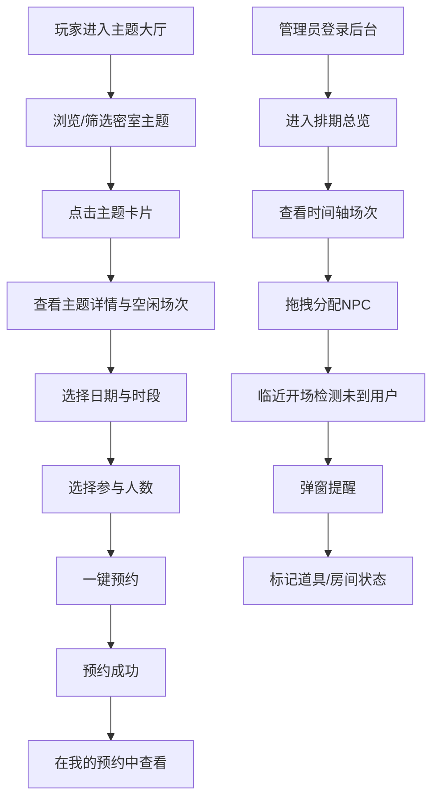

## 1. 产品概述

密室逃脱预约排期与人员调度管理系统，面向玩家和密室运营方双端使用。玩家端以卡片式浏览密室主题，查看难度、容纳人数、空闲场次并一键预约；运营后台以时间轴可视化管控所有场次排期，拖拽分配 NPC，自动提醒未到用户，标记道具与房间状态，统计主题人气，实现全程线上可视化管控。

- 目标用户：密室逃脱玩家（C端）、密室运营管理人员（B端）
- 核心价值：消除线下沟通成本，提升预约效率与运营可视化水平

## 2. 核心功能

### 2.1 用户角色

| 角色 | 注册方式 | 核心权限 |
|------|----------|----------|
| 玩家 | 手机号注册 | 浏览主题、查看场次、预约、取消预约 |
| 运营管理员 | 后台分配账号 | 排期管理、NPC调度、场次状态管理、数据统计 |

### 2.2 功能模块

**玩家端：**
1. **主题大厅页**：卡片式展示所有密室主题（封面图、名称、难度标签、容纳人数）
2. **主题详情页**：难度详情、剧情简介、容纳人数、空闲场次列表、一键预约
3. **我的预约页**：已预约列表、取消预约、预约状态跟踪

**运营后台：**
1. **排期总览页**：所有场次时间轴可视化、拖拽调整 NPC 分配、场次状态管理
2. **主题管理页**：新增/编辑密室主题、设置难度/容纳人数/时长
3. **现场管控页**：未到用户弹窗提醒、道具损坏标记、房间清洁状态管理
4. **数据统计页**：各主题人气占比图表、预约量趋势、NPC工作量统计

### 2.3 页面详情

| 页面名称 | 模块名称 | 功能描述 |
|----------|----------|----------|
| 主题大厅 | 主题卡片列表 | 展示所有密室主题卡片，支持按难度/人数筛选 |
| 主题大厅 | 搜索与筛选栏 | 关键词搜索、难度筛选、人数筛选 |
| 主题详情 | 基本信息区 | 展示主题封面、名称、难度星级、容纳人数、时长 |
| 主题详情 | 剧情简介区 | 展示主题故事背景与剧情简介 |
| 主题详情 | 场次选择区 | 日历选择日期，展示当日空闲场次时段 |
| 主题详情 | 预约操作区 | 选择人数、一键锁定场次完成预约 |
| 我的预约 | 预约列表 | 展示所有预约记录及状态（待开始/进行中/已结束/已取消） |
| 我的预约 | 取消预约 | 对未开始场次进行取消 |
| 排期总览 | 时间轴面板 | 横向时间轴展示所有房间场次安排 |
| 排期总览 | NPC 分配面板 | 拖拽 NPC 头像分配到对应房间场次 |
| 排期总览 | 场次状态管理 | 点击场次修改状态（空闲/已预约/进行中/已结束） |
| 主题管理 | 主题列表 | 展示所有主题，支持增删改 |
| 主题管理 | 主题编辑表单 | 编辑主题名称、封面、难度、人数、时长、剧情 |
| 现场管控 | 未到提醒弹窗 | 临近开场未到用户自动弹窗提醒 |
| 现场管控 | 道具状态标记 | 标记道具损坏/正常状态 |
| 现场管控 | 房间清洁状态 | 标记房间待清洁/已清洁状态 |
| 数据统计 | 主题人气占比 | 饼图展示各主题预约量占比 |
| 数据统计 | 预约量趋势 | 折线图展示近7天/30天预约量趋势 |
| 数据统计 | NPC工作量 | 柱状图展示 NPC 排班场次数量 |

## 3. 核心流程

**玩家预约流程：**
用户进入主题大厅 → 浏览/搜索密室主题 → 点击感兴趣的主题卡片 → 查看详情与空闲场次 → 选择日期与时段 → 选择参与人数 → 点击一键预约 → 预约成功 → 在我的预约中查看

**运营排期流程：**
管理员登录后台 → 进入排期总览 → 查看时间轴所有场次 → 拖拽 NPC 到对应场次 → 临近开场系统检测未到用户 → 弹窗提醒 → 管理员处理 → 标记道具/房间状态

## 4. 用户界面设计

### 4.1 设计风格

- **主题风格**：暗黑沉浸式风格，以深色为主基调搭配霓虹高亮色，营造密室逃脱的神秘悬疑氛围
- **主色调**：深灰黑（#0D0D0D）为底色，霓虹青（#00F0FF）为主强调色，暗红（#FF2D55）为警示/热门标记
- **次色调**：暗紫（#6B2FA0）为辅助色，暖橙（#FF8C00）为评分/难度标记
- **按钮风格**：圆角矩形，霓虹发光边框效果，hover 时增强发光
- **字体**：标题使用 Orbitron（科技感显示字体），正文使用 Noto Sans SC（中文优化）
- **布局风格**：玩家端卡片式瀑布流布局，后台时间轴+面板布局
- **图标风格**：线性描边图标（Lucide），搭配霓虹色发光效果

### 4.2 页面设计概览

| 页面名称 | 模块名称 | UI元素 |
|----------|----------|--------|
| 主题大厅 | 主题卡片列表 | 深色卡片、封面图、霓虹边框、难度星级、人数标签、hover 发光动效 |
| 主题大厅 | 搜索与筛选栏 | 搜索框、下拉筛选器、霓虹按钮 |
| 主题详情 | 基本信息区 | 大封面图、霓虹标题、难度星级条、人数/时长标签 |
| 主题详情 | 场次选择区 | 日历组件、时段网格、空闲=青色/已满=灰色标记 |
| 主题详情 | 预约操作区 | 人数选择器、霓虹发光预约按钮、预约成功动效 |
| 我的预约 | 预约列表 | 深色卡片列表、状态标签（彩色圆点）、取消按钮 |
| 排期总览 | 时间轴面板 | 横向时间轴、房间行、场次色块、拖拽高亮 |
| 排期总览 | NPC 分配面板 | NPC头像卡片、拖拽手柄、分配连线 |
| 现场管控 | 未到提醒弹窗 | 居中模态弹窗、红色脉冲边框、用户信息、联系按钮 |
| 现场管控 | 道具/房间状态 | 状态卡片网格、绿色/红色状态指示、点击切换 |
| 数据统计 | 图表区域 | 深色背景饼图/折线图/柱状图、霓虹色数据线 |

### 4.3 响应式设计

- 桌面优先设计，玩家端在移动端自适应为单列卡片流
- 后台管理界面以桌面大屏为主，时间轴需宽屏展示
- 触控优化：后台拖拽操作支持触摸事件

### 4.4 3D 场景指引

- 不适用（本项目为 2D Web 应用）
