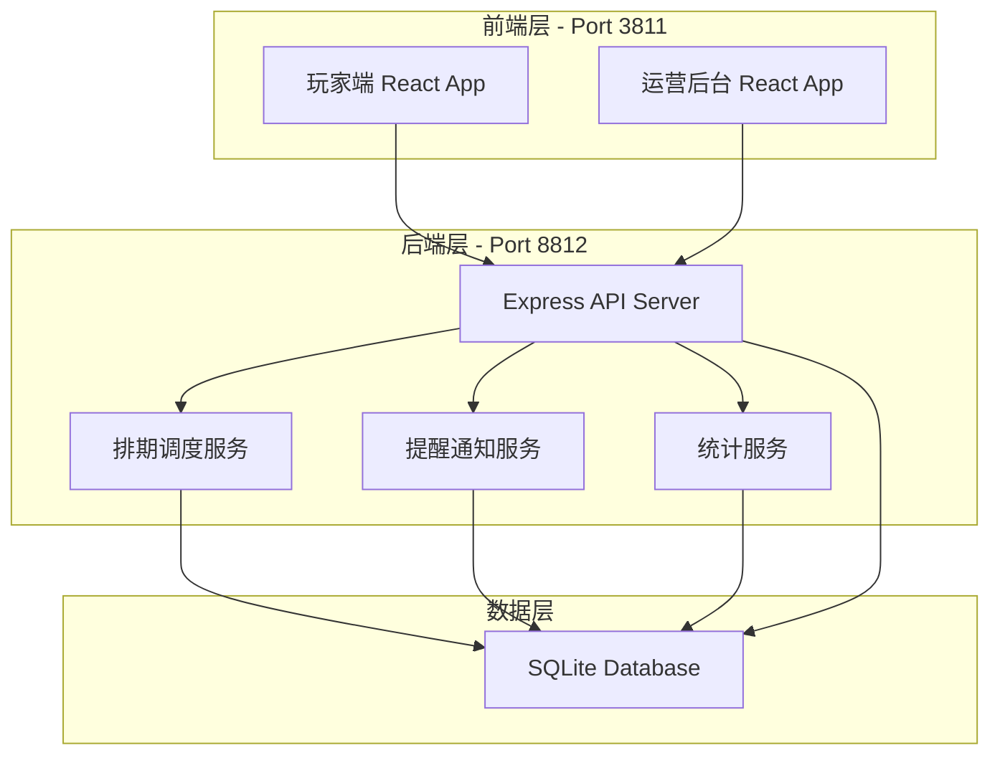
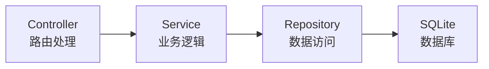
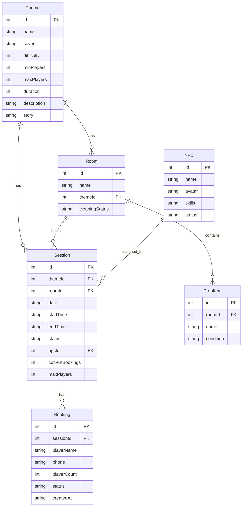

## 1. 架构设计



## 2. 技术说明

- 前端：React@18 + TailwindCSS@3 + Vite + Zustand + React Router DOM
- 初始化工具：vite-init
- 后端：Express@4 + TypeScript（ESM 格式）
- 数据库：SQLite（better-sqlite3），Mock 数据填充
- 图表库：recharts
- 拖拽库：@dnd-kit/core + @dnd-kit/sortable
- 日期处理：dayjs
- 前端端口：3811，后端端口：8812

## 3. 路由定义

### 玩家端路由

| 路由 | 用途 |
|------|------|
| / | 主题大厅页，卡片式展示所有密室主题 |
| /theme/:id | 主题详情页，查看难度/人数/场次/预约 |
| /my-bookings | 我的预约页，预约列表与取消 |

### 运营后台路由

| 路由 | 用途 |
|------|------|
| /admin | 排期总览页，时间轴+NPC拖拽分配 |
| /admin/themes | 主题管理页，增删改密室主题 |
| /admin/onsite | 现场管控页，提醒/道具/房间状态 |
| /admin/stats | 数据统计页，人气占比/趋势/工作量 |

## 4. API 定义

### 主题相关

```typescript
interface Theme {
  id: number;
  name: string;
  cover: string;
  difficulty: 1 | 2 | 3 | 4 | 5;
  minPlayers: number;
  maxPlayers: number;
  duration: number;
  description: string;
  story: string;
}

GET    /api/themes          → Theme[]
GET    /api/themes/:id      → Theme
POST   /api/themes          → Theme
PUT    /api/themes/:id      → Theme
DELETE /api/themes/:id      → { success: boolean }
```

### 场次相关

```typescript
interface Session {
  id: number;
  themeId: number;
  roomId: number;
  date: string;
  startTime: string;
  endTime: string;
  status: "available" | "booked" | "in_progress" | "completed" | "cancelled";
  npcId: number | null;
  currentBookings: number;
  maxPlayers: number;
}

GET    /api/sessions?date=&themeId=  → Session[]
GET    /api/sessions/:id             → Session
POST   /api/sessions                 → Session
PUT    /api/sessions/:id             → Session
PUT    /api/sessions/:id/assign-npc  → { npcId: number } → Session
```

### 预约相关

```typescript
interface Booking {
  id: number;
  sessionId: number;
  playerName: string;
  phone: string;
  playerCount: number;
  status: "pending" | "confirmed" | "cancelled" | "no_show";
  createdAt: string;
}

GET    /api/bookings?phone=          → Booking[]
POST   /api/bookings                 → Booking
PUT    /api/bookings/:id/cancel      → Booking
GET    /api/bookings/upcoming-alerts → Booking[]
```

### NPC 相关

```typescript
interface NPC {
  id: number;
  name: string;
  avatar: string;
  skills: string[];
  status: "available" | "assigned" | "off";
}

GET    /api/npcs           → NPC[]
PUT    /api/npcs/:id       → NPC
```

### 房间状态相关

```typescript
interface Room {
  id: number;
  name: string;
  themeId: number;
  cleaningStatus: "clean" | "dirty";
  propsStatus: { name: string; condition: "normal" | "damaged" }[];
}

GET    /api/rooms           → Room[]
PUT    /api/rooms/:id       → Room
PUT    /api/rooms/:id/props → Room
```

### 统计相关

```typescript
interface ThemeStat {
  themeId: number;
  themeName: string;
  bookingCount: number;
  percentage: number;
}

interface TrendData {
  date: string;
  count: number;
}

interface NPCWorkload {
  npcId: number;
  npcName: string;
  sessionCount: number;
}

GET /api/stats/theme-popularity → ThemeStat[]
GET /api/stats/booking-trend?days=7|30 → TrendData[]
GET /api/stats/npc-workload → NPCWorkload[]
```

## 5. 服务器架构图



## 6. 数据模型

### 6.1 数据模型定义



### 6.2 数据定义语言

```sql
CREATE TABLE themes (
  id INTEGER PRIMARY KEY AUTOINCREMENT,
  name TEXT NOT NULL,
  cover TEXT NOT NULL,
  difficulty INTEGER NOT NULL CHECK(difficulty BETWEEN 1 AND 5),
  min_players INTEGER NOT NULL,
  max_players INTEGER NOT NULL,
  duration INTEGER NOT NULL,
  description TEXT DEFAULT '',
  story TEXT DEFAULT ''
);

CREATE TABLE rooms (
  id INTEGER PRIMARY KEY AUTOINCREMENT,
  name TEXT NOT NULL,
  theme_id INTEGER NOT NULL REFERENCES themes(id),
  cleaning_status TEXT NOT NULL DEFAULT 'clean' CHECK(cleaning_status IN ('clean', 'dirty'))
);

CREATE TABLE npcs (
  id INTEGER PRIMARY KEY AUTOINCREMENT,
  name TEXT NOT NULL,
  avatar TEXT NOT NULL DEFAULT '',
  skills TEXT NOT NULL DEFAULT '[]',
  status TEXT NOT NULL DEFAULT 'available' CHECK(status IN ('available', 'assigned', 'off'))
);

CREATE TABLE sessions (
  id INTEGER PRIMARY KEY AUTOINCREMENT,
  theme_id INTEGER NOT NULL REFERENCES themes(id),
  room_id INTEGER NOT NULL REFERENCES rooms(id),
  date TEXT NOT NULL,
  start_time TEXT NOT NULL,
  end_time TEXT NOT NULL,
  status TEXT NOT NULL DEFAULT 'available' CHECK(status IN ('available', 'booked', 'in_progress', 'completed', 'cancelled')),
  npc_id INTEGER REFERENCES npcs(id),
  current_bookings INTEGER NOT NULL DEFAULT 0,
  max_players INTEGER NOT NULL
);

CREATE TABLE bookings (
  id INTEGER PRIMARY KEY AUTOINCREMENT,
  session_id INTEGER NOT NULL REFERENCES sessions(id),
  player_name TEXT NOT NULL,
  phone TEXT NOT NULL,
  player_count INTEGER NOT NULL,
  status TEXT NOT NULL DEFAULT 'pending' CHECK(status IN ('pending', 'confirmed', 'cancelled', 'no_show')),
  created_at TEXT NOT NULL DEFAULT (datetime('now'))
);

CREATE TABLE prop_items (
  id INTEGER PRIMARY KEY AUTOINCREMENT,
  room_id INTEGER NOT NULL REFERENCES rooms(id),
  name TEXT NOT NULL,
  condition TEXT NOT NULL DEFAULT 'normal' CHECK(condition IN ('normal', 'damaged'))
);

CREATE INDEX idx_sessions_date ON sessions(date);
CREATE INDEX idx_sessions_theme ON sessions(theme_id);
CREATE INDEX idx_sessions_npc ON sessions(npc_id);
CREATE INDEX idx_bookings_session ON bookings(session_id);
CREATE INDEX idx_bookings_phone ON bookings(phone);
CREATE INDEX idx_prop_items_room ON prop_items(room_id);
```
